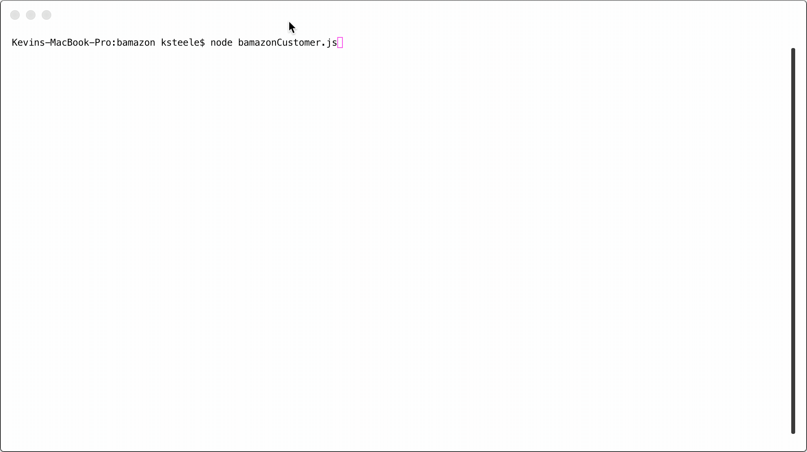
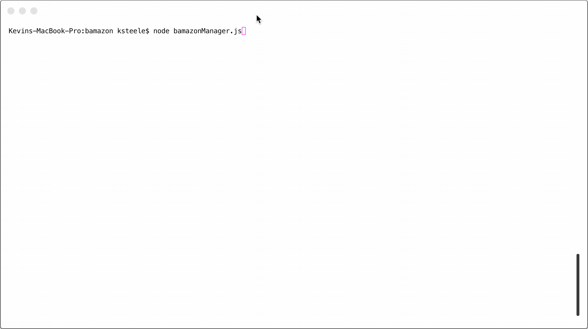
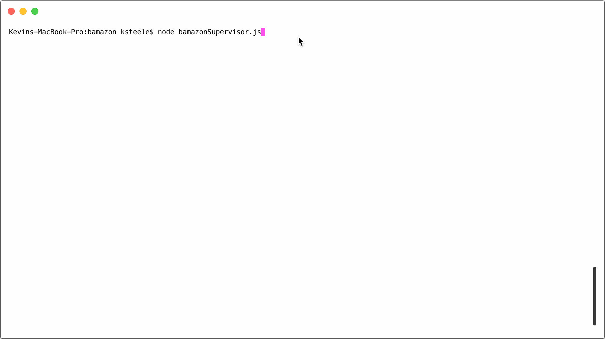

# Bamazon - a CLI Amazon like Application for learning Node and MySQL 

## This is an application that demonstrates how to intergate Node and a MySQL database

### Fully developed by Kevin Steele for GWU Full Stack Web Development BootCamp 

**Github repo**:https://github.com/kevdsteele/bamazon

### Dependencies

* **[Node.JS](https://nodejs.org/en/download/)** must be installed to run this application

> * [Chalk](https://www.npmjs.com/package/chalk), [Inquirer](https://www.npmjs.com/package/inquirer) and [MySQL](https://www.npmjs.com/package/mysql) and [Console.Table] (https://www.npmjs.com/package/console.table)node packages must also be installed before running this application*

* The Node **MySQL** package is used to integrate and connect to a MySQL Database called bamazon_DB. 
* The Node **Inquirer** package is used to get the user input. 
* The Node **Chalk** package is used to provide color output to the console. 
* The Node **Console.Table** package is used to display MySQL data in a simple table format 

### Organization

### This application consists of three main files

> **bamazonCustomer.js** 

> This is a customer facing CLI allowing users to browse for Products, Add them to a Cart and then checkout

> **bamazonManager.js** 

> This is a Manager facing CLI that allows Managers to view Products, Add Inventory and Add Products to the database

> **bamazonSupervisor.js** 

> This is a Supervisor facing CLI that allows Supervisors to view Product sales and uses Aliases to display and calculate totals. It also allows Supervisors to Add a new Department to the database

## Demos

### Customer CLI 

### Manager CLI 

### Supervisor CLI

